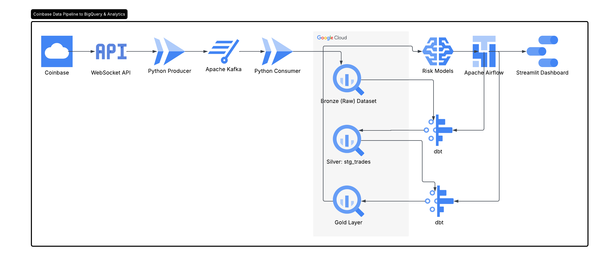

## Real-Time Crypto Risk Intelligence Platform

A real-time data engineering platform that streams live cryptocurrency market data from the Coinbase WebSocket API, processes it using Apache Kafka, stores it in Google BigQuery, transforms it with dbt, orchestrates workflows with Apache Airflow, and visualizes risk analytics through a Streamlit dashboard.

**Tech Stack** : Python, Apache Kafka, Google BigQuery, dbt (Data Build Tool), Apache Airflow, Streamlit, Docker

### Architecture

### Features

- **Real-Time Data Streaming**: Streams live cryptocurrency market data using the Coinbase WebSocket API.
- **Risk Analytics**: Identifies and visualizes potential trading risks in real-time includes risk classification, trade volume and price movement.
- **Data Storage**: Stores processed data in Google BigQuery for scalability and fast querying.
- **Data Transformation**: Uses dbt to clean, transform, and model data for analytics.
- **Workflow Orchestration**: Automates data pipelines with Apache Airflow.
- **Interactive Dashboard**: Provides a Streamlit dashboard for visualizing insights.
- **Scalable Architecture**: Built with Docker and Apache Kafka for scalability and reliability.
